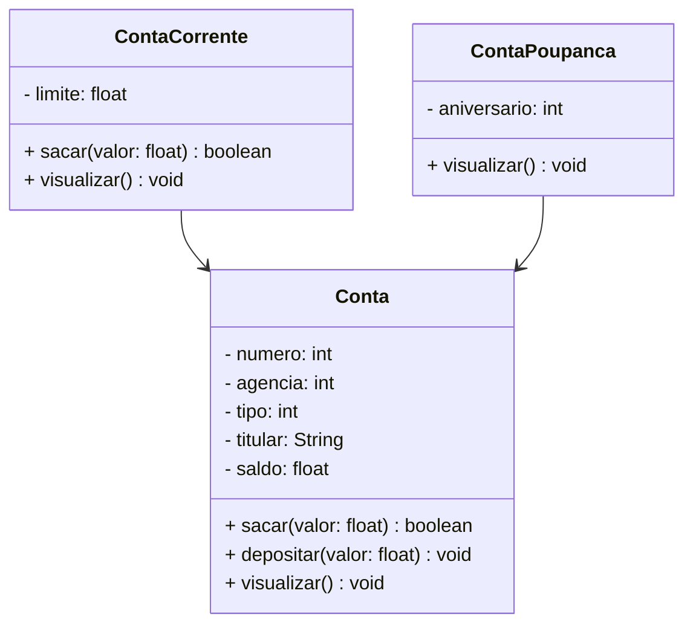

# 💳 Projeto Conta Bancária - Java

<div align="center">
  
  
  
  
  
 

  <br/>
  
</div>

---

## 📖 Sumário
- [📌 Descrição](#descrição)
- [⚙️ Funcionalidades](#funcionalidades)
- [📊 Diagrama de Classes](#diagrama-de-classes)
- [🖥️ Demonstração](#demonstração)
- [🛠️ Tecnologias](#tecnologias)
- [🚀 Como Executar](#como-executar)
- [🛣️ Roadmap](#roadmap)
- [🤝 Contribuição](#contribuição)
- [👥 Contribuidores](#contribuidores)
- [📬 Contato](#contato)
- [📄 Licença](#licença)

---

## 📌 Descrição

O **Projeto Conta Bancária** é um sistema simples de simulação bancária desenvolvido em **Java**, com foco no estudo de **Programação Orientada a Objetos (POO)**.  

Ele permite criar e gerenciar contas bancárias, realizar transações e aplicar conceitos como:  
✔️ Classes e Objetos  
✔️ Herança e Polimorfismo  
✔️ Encapsulamento  
✔️ Abstração  

---

## ⚙️ Funcionalidades

✅ Criar conta com número gerado automaticamente  
✅ Listar todas as contas cadastradas  
✅ Consultar conta por número ou titular  
✅ Editar e excluir contas  
✅ Realizar saques e depósitos  
✅ Transferir valores entre contas  

---

## 📊 Diagrama de Classes



---

## 🖥️ Demonstração

Exemplo do menu principal no console:

```bash
=============================
   BANCO DIGITAL JAVA
=============================

1 - Criar Conta
2 - Listar Contas
3 - Consultar Conta por Número
4 - Consultar Conta por Titular
5 - Editar Conta
6 - Excluir Conta
7 - Sacar
8 - Depositar
9 - Transferir
0 - Sair
```

---

## 🛠️ Tecnologias

- ☕ [Java JDK 17+](https://www.oracle.com/java/technologies/downloads/#java17)  
- 🛠️ [Eclipse](https://eclipseide.org/) ou [Eclipse STS](https://spring.io/tools)  

---

## 🚀 Como Executar

### 1. Clone o repositório
```bash
git clone https://github.com/LemesdeMorais/conta_bancaria.git
```

### 2. Importe no Eclipse/STS
- File → Import → Existing Projects into Workspace  
- Selecione a pasta clonada  
- Finalize a importação  

### 3. Execute
- Abra a classe `Menu`  
- Clique em **Run ▶️**  
- O menu será exibido no console  

---

## 🛣️ Roadmap

🔜 Melhorias planejadas:
- [ ] Adicionar persistência em banco de dados  
- [ ] Criar testes unitários (JUnit)  
- [ ] Implementar interface gráfica (JavaFX ou Swing)  
- [ ] Disponibilizar versão Docker  

---

## 🤝 Contribuição

Contribuições são muito bem-vindas!  
Você pode:
- Criar uma **issue**  
- Enviar um **pull request**  
- Sugerir melhorias  

---

## 👥 Contribuidores

<a href="https://github.com/LemesdeMorais/conta_bancaria/graphs/contributors">
  
</a>

---

## 📬 Contato

👨‍💻 Desenvolvido por [**Rafaela Lemes**](https://github.com/LemesdeMorais)  
📩 Se tiver dúvidas ou sugestões, entre em contato via GitHub ou abra uma issue.  

---

## 📄 Licença

Este projeto está sob a licença **MIT**.  
Sinta-se à vontade para usar, modificar e compartilhar.  
